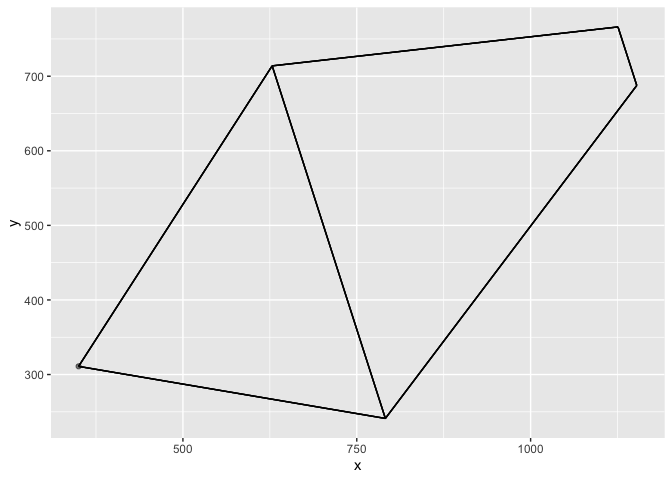

<!-- README.md is generated from README.Rmd. Please edit that file -->

# bicycle

<!-- badges: start -->
<!-- badges: end -->

This package started out as just a few R functions and notes that
reproduced the calculations in Chapter 4 of [Lugged Bicycle Frame
Construction, 3rd
Ed.](https://www.amazon.com/dp/1492232645?psc=1&ref=ppx_yo2_dt_b_product_details)
by Marc-Andre R. Chimonas. It allows you to save multiple frame designs
and compare any two them as a ggplot object. The main goal of this
package is to provide a framework where I can add more functions as the
need arises.

For example, bicycle makers publish geometry tables on their websites
for models that they have in production. These tables have some useful
dimensions – seat tube length, head tube angle, fork rake, etc. – but
they do not show everything that you need to sketch out the frame and
compare it to another. It would be nice to have some functions on hand
that can derive what’s missing from what’s available.

## Installation

You can install the development version of bicycle from
[GitHub](https://github.com/) with:

``` r
# install.packages("devtools")
devtools::install_github("ghuiber/bicycle")
```

## Example

Here’s a simple way to derive the bottom bracket drop from some frame
dimensions:

``` r
library(bicycle)
get_bb_drop(60, 72, 430, 10)
#> [1] 89.06183
```

And here’s a basic bike frame:

``` r
library(magrittr)
wrap_frame_dims(tt_angle = 6, 
                st_dt_angle = 58, 
                cs_st_angle = 62) %>% 
  draw_the_bicycle()
#> Joining, by = "st_triangle"
```



See the vignette for more.
