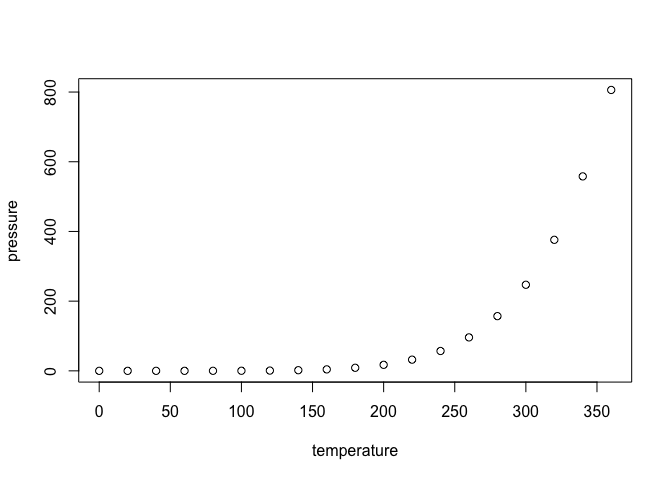

<!-- README.md is generated from README.Rmd. Please edit that file -->

# bicycle

<!-- badges: start -->
<!-- badges: end -->

This package started out as just a few R functions and notes that
reproduced the calculations in Chapter 4 of [Lugged Bicycle Frame
Construction, 3rd
Ed.](https://www.amazon.com/dp/1492232645?psc=1&ref=ppx_yo2_dt_b_product_details)
by Marc-Andre R. Chimonas. It allows you to save multiple frame designs
and compare any two them as a ggplot object. The main goal of this
package is to provide a framework where I can add more functions as the
need arises. For example, I would like to be able to eventually deriving
all the missing frame dimensions from published frame geometry tables
and sketch the frames out for visual comparisons.

## Installation

You can install the development version of bicycle from
[GitHub](https://github.com/) with:

``` r
# install.packages("devtools")
devtools::install_github("ghuiber/bicycle")
```

## Example

Here’s a simple way to derive the bottom bracket drop from some frame
dimensions:

``` r
library(bicycle)
get_bb_drop(60, 72, 430, 10)
#> [1] 89.06183
```

What is special about using `README.Rmd` instead of just `README.md`?
You can include R chunks like so:

``` r
summary(cars)
#>      speed           dist       
#>  Min.   : 4.0   Min.   :  2.00  
#>  1st Qu.:12.0   1st Qu.: 26.00  
#>  Median :15.0   Median : 36.00  
#>  Mean   :15.4   Mean   : 42.98  
#>  3rd Qu.:19.0   3rd Qu.: 56.00  
#>  Max.   :25.0   Max.   :120.00
```

You’ll still need to render `README.Rmd` regularly, to keep `README.md`
up-to-date. `devtools::build_readme()` is handy for this. You could also
use GitHub Actions to re-render `README.Rmd` every time you push. An
example workflow can be found here:
<https://github.com/r-lib/actions/tree/v1/examples>.

You can also embed plots, for example:



In that case, don’t forget to commit and push the resulting figure
files, so they display on GitHub and CRAN.
